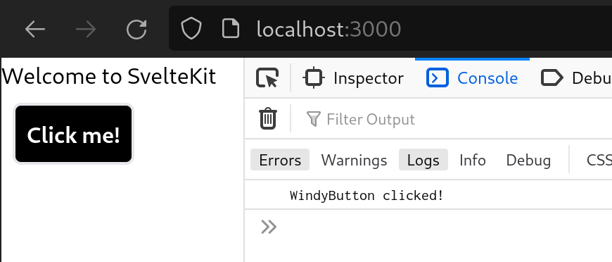

# How to create a button component using `Svelte` + `TailwindCSS`

## Step 1 - Create a new project using `SvelteKit`

    > npm init svelte@next WindyButton

## Step 2 - Add `TailwindCSS` using `svelte-add`

    > cd WindyButton
    > npx svelte-add@latest tailwindcss
    > npm install

## Step 3 - Create the component

    <!-- src/components/WindyButton.svelte -->
    
    <!-- Svelte event forwarding -->
    <button on:click >Click me!</button>
    <!-- Notice how you don't need to wrap the button in a div! -->
    
    

## Step 4 - Use the component

    <!-- src/routes/index.svelte -->
    
    
    
    <h1>Welcome to SvelteKit</h1>
    
    <WindyButton
    	on:click={() => {
    		console.log('WindyButton clicked!');
    	}}
    />

## Step 5 - Witness the glory

